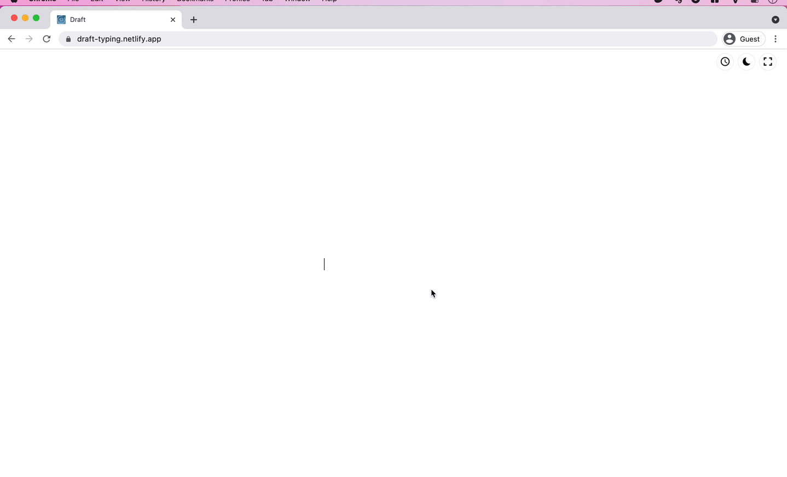

# Draft Typing

Just a simple editor for your next drafts. It supports light/dark theme toggle, full-screen mode, auto-resize with your typing, no format.

Shortcuts:

* Ctrl + s : Dark/Light mode
* Ctrl + x : Fullscreen mode

## Development server

Run `ng serve` for a dev server. Navigate to `http://localhost:4200/`. The app will automatically reload if you change any of the source files.

## Build

Run `ng build` to build the project. The build artifacts will be stored in the `dist/` directory. Use the `--prod` flag for a production build.

## Further help

To get more help on the Angular CLI use `ng help` or go check out the [Angular CLI README](https://github.com/angular/angular-cli/blob/master/README.md).
